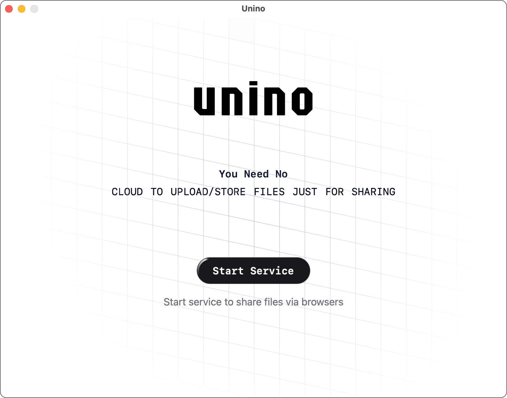
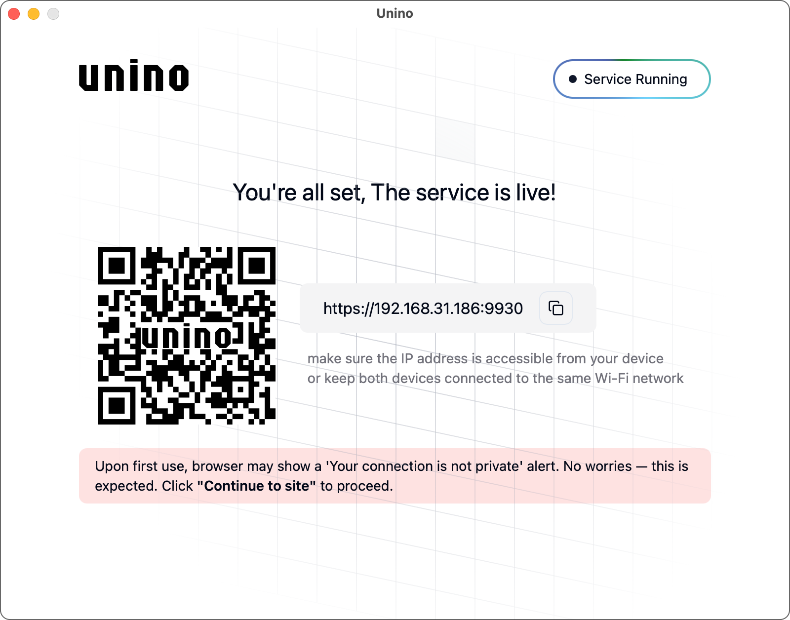

# Unino - Local Network File Sharing Tool

### homepage: [https://www.unino.tech](https://www.unino.tech)

## 🚀 What is Unino?

**Unino** is a desktop application that enables lightning-fast **cross-platform file sharing** within your local
network.
Once installed on your computer, it creates a secure web server allowing any device (phones, tablets, or other
computers) to:

📁 Upload/download files via a browser

📱 Access shared files without installing apps

🔍 Preview common file types instantly
 
**Core Advantages:**

✅ No cloud storage required (direct device-to-device transfers)

✅ Zero user accounts or configuration

## ✨ Key Features

- 🌐 Browser Access: Connect via QR code or manual URL entry
- 📦 Drag & Drop Sharing: Instantly share files/folders from webpage
- 🔒 Local Network Security: No data leaves your private network
- 🖼️ Built-in Previewer: Supports documents, images, audio, and videos
- ⚡ Single-device installation, universal access - no extra installation required on other devices

## 📥 Installation && Usage Guide

Supported OS: Windows 10/11, macOS 10.15+

1. **Download Installer:**

   Visit [unino.tech](https://www.unino.tech) and choose your OS version.

2. **Install:**

   Windows: Double-click Unino.exe

   macOS: Drag Unino.app to Applications folder

3. **Start Sharing:**

   Launch Unino on your desktop

4. **Access Options:**

   Scan the QR code with your phone camera
   OR Enter the displayed URL (e.g., http://192.168.1.5:9930) in any browser

## ❓ FAQ

**Q: Why can't I launch the software?**

Windows: Add the software to exceptions in Windows Security.

macOS: Grant permissions under System Preferences → Privacy & Security → Security.

**Q: Why can't my device access the Unino web page?**

A: Ensure both devices are on the same Wi-Fi/LAN. For Virtual Machine users:
- Switch to **bridged networking mode** in your VM settings.
- Temporarily disable: **Firewall & network protection** and **App & Browser Control** (under Windows Security settings)

**Q: Does file sharing work offline?**

Yes! Unino uses your local network - no internet required.

**Q: What file types can be previewed?**

Supported formats include:

Images: PNG, JPEG, WebP, GIF, SVG

Audio: MP3, WAV, OGG, AAC

Video: MP4, MOV, WebM, MKV

> Note: Actual preview capability depends on your browser's media codec support.

**Q: How many devices can connect simultaneously?**

The theoretical connection limit is 1,000+ concurrent devices  (based on protocol design), though this has not been
fully stress-tested. Real-world performance depends on:
- Hardware specifications (CPU/RAM)
- Network bandwidth and router capacity
- Concurrent file transfer operations

### screen shots

